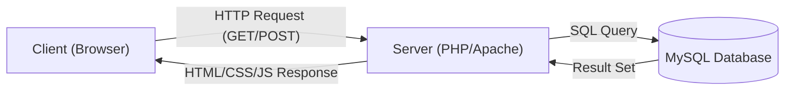
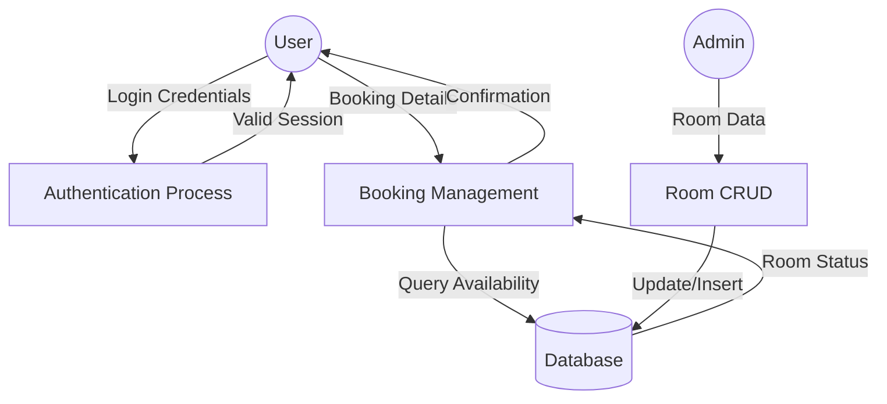
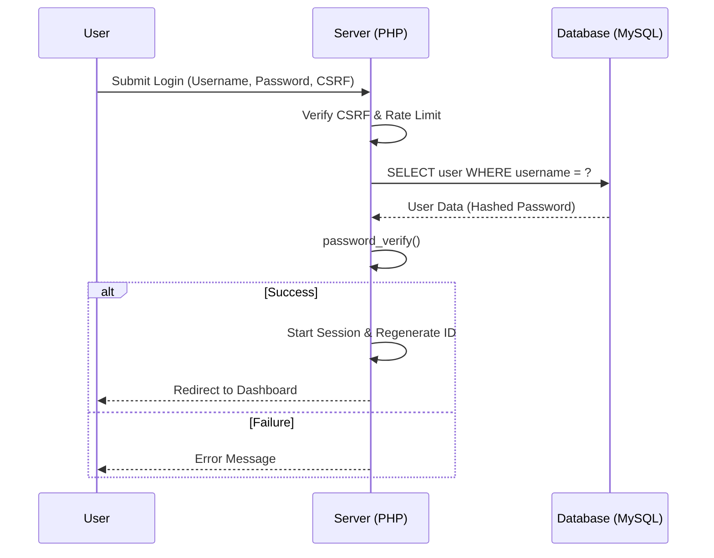
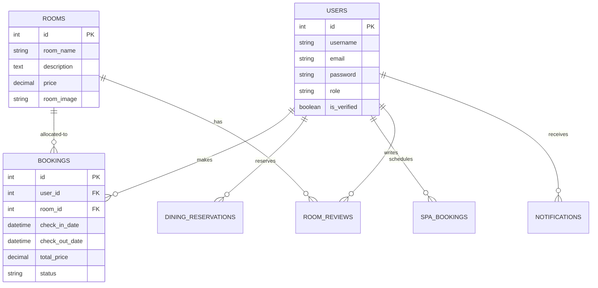

# Casa-Aurelia System Documentation

## 1. PROJECT PROPOSAL

### 1.1 Project Overview
*   **Brief Description**: Casa-Aurelia is a premium hotel management and booking system designed to provide a seamless digital experience for guests and administrative efficiency for hotel staff.
*   **Type of System**: Hotel Booking and Content Management System (CMS).
*   **Purpose**: To automate the reservation process for rooms, dining, and spa services while providing a modern interface for guests to explore luxury amenities.
*   **Problems Addressed**:
    *   Manual booking errors and double-bookings.
    *   Lack of a centralized platform for various hotel services (Rooms, Spa, Dining).
    *   Inefficient communication of availability to potential guests.
*   **Client-Server Architecture**: The system utilizes a traditional client-server model where the **Client** (web browser) makes HTTP requests to the **Server** (XAMPP/Apache). The server processes PHP logic, interacts with the **MySQL Database**, and returns HTML/CSS/JS responses to the client.

### 1.2 Objectives of the System
*   Provide a user-friendly 24/7 online booking platform.
*   Implement a secure administrative dashboard for managing hotel inventory (Rooms).
*   Ensure data integrity and security through modern web practices.
*   Offer real-time availability checks for rooms.

### 1.3 Target Users
*   **Guests**: Individuals looking to book stay, dining, or spa sessions.
*   **Administrators**: Hotel staff responsible for managing bookings, rooms, and monitoring system activities.

### 1.4 Scope and Limitations
*   **Scope**:
    *   User Authentication (Login, Register, Password Reset).
    *   Room Management CRUD (Admin).
    *   Booking System (Room, Dining, Spa).
    *   Notification System for booking status.
    *   Responsive Landing Page and Public Suites view.
*   **Limitations**:
    *   Does not include an integrated payment gateway (simulated confirmation).
    *   Does not include multi-language support.

---

## 2. SYSTEM DESIGN

### 2.1 System Architecture (Client-Server Workflow)


### 2.2 Data Flow Diagram (DFD Level 1)


### 2.3 System Sequence Diagram (Authentication)


### 2.4 Database Design (ERD)


---

## 3. DEVELOPMENT PHASE

### 3.1 Tools and Technologies Used
*   **Frontend**: HTML5, Tailwind CSS, JavaScript (ES6+), Font Awesome.
*   **Backend**: PHP 8.1+ (Object-Oriented & Procedural mix).
*   **Database**: MySQL (MariaDB).
*   **Tools**: XAMPP (Apache/MySQL), VS Code, Composer, NPM.

### 3.2 System Screenshots & Interface Summary

````carousel

<!-- slide -->

<!-- slide -->

<!-- slide -->

````

### 3.3 Core Code Explanations

#### 3.3.1 Secure Database Connectivity
The system uses a centralized `db.php` to manage connections, ensuring that any changes to credentials only need to be made in one place.
```php
$conn = new mysqli($servername, $username, $password, $dbname);
$conn->set_charset("utf8"); // Ensures UTF-8 encoding for multi-language support
```

#### 3.3.2 Prepared Statements (SQL Injection Prevention)
To prevent SQL injection, the system never interpolates user input directly into queries. Instead, it uses prepared statements:
```php
$stmt = $conn->prepare("SELECT password FROM users WHERE email = ?");
$stmt->bind_param("s", $email); // "s" denotes the parameter type is a string
$stmt->execute();
```

#### 3.3.3 Frontend Logic (Availability Checking)
JavaScript is used to provide a responsive experience. For example, `api/check_availability.php` is called via Fetch API to check room status without a page reload.

---

## 4. TESTING PHASE

### 4.1 Test Cases & Results

| Test Case ID | Feature | Description | Expected Result | Actual Result | Status |
| :--- | :--- | :--- | :--- | :--- | :--- |
| TC-01 | Authentication | Login with invalid credentials | System shows "Invalid credentials" error | Error message displayed | PASS |
| TC-02 | Authentication | Login with valid admin credentials | Redirect to Admin Dashboard | Successfully redirected | PASS |
| TC-03 | Booking | Book room during overlapping dates | System prevents booking and shows error | Overlap detected, error shown | PASS |
| TC-04 | CRUD | Admin adds a new room | Room appears in the room management list | Room added successfully | PASS |
| TC-05 | Security | Submit form with missing CSRF token | Request is rejected with security error | 403/Error message shown | PASS |

### 4.2 Bug Fixes & Refinements
*   **Fixed**: Path calculation error in `paths.php` when the system was running in nested subdirectories.
*   **Refinement**: Optimized the total price calculation in `add_booking.php` to handle hourly overages correctly.

---

## 5. CONCLUSION
The development of Casa-Aurelia provided a deep dive into the complexities of **state management** and **secure web architecture**. By implementing rigorous security measures like CSRF protection and prepared statements, we ensured a robust system that protects user data. The most significant challenge was the logic for handling overlapping booking dates, which was solved using an efficient SQL `BETWEEN` and `DATE_ADD` logic. Future versions will integrate automated email notifications and an interactive floor plan for room selection.
